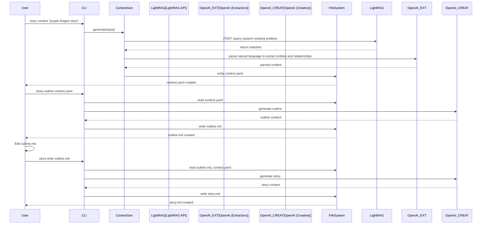

# Bedtime Story Generator Architecture Document

## Introduction

This document outlines the overall project architecture for the Bedtime Story Generator, including backend systems, shared services, and non-UI specific concerns. Its primary goal is to serve as the guiding architectural blueprint for AI-driven development, ensuring consistency and adherence to chosen patterns and technologies.

**Relationship to Frontend Architecture:**
This initial version focuses on the CLI implementation. A future Frontend Architecture Document will detail the Angular web application design when that phase begins.

### Starter Template or Existing Project

N/A - Greenfield project

### Change Log

| Date | Version | Description | Author |
|------|---------|-------------|--------|
| 2024-01-15 | 1.0 | Initial architecture | Architect |

Now let me work through the high-level architecture section. I'll present the complete section for your review.

## High Level Architecture

### Technical Summary

The system employs a modular pipeline architecture with three distinct stages (context generation, outline creation, story writing) that process data sequentially through file-based intermediates. Built as a Python CLI application, it integrates with the LightRAG API for read-only entity retrieval and uses OpenAI's API for content generation. The architecture prioritizes human control through editable intermediate files, cost optimization through token tracking, and extensibility through external template files. This design directly supports the PRD goals of controlled story generation with consistent world-building.

### High Level Overview

The main architectural style is a **Pipeline Architecture** with file-based communication between stages. This aligns with the PRD's requirement for human intervention at each stage.

- **Repository Structure**: Monorepo containing CLI application, templates, and tests
- **Service Architecture**: Monolithic CLI with modular components
- **Data Flow**: Natural Language Input → Context (YAML) → Outline (Markdown) → Story (Markdown)
- **Key Decision Rationale**: File-based intermediates allow manual editing and parallel story development
- **Context Management**: Intelligent context updates preserve all user prompts and enable iterative story building

### High Level Project Diagram


### Architectural and Design Patterns

- **Pipeline Pattern:** Three-stage sequential processing with file-based communication - *Rationale:* Enables human intervention and independent stage execution
- **Repository Pattern:** Abstract LightRAG API operations behind interface - *Rationale:* Enables testing with mocks and future retrieval system migration
- **Template Method Pattern:** External templates with variable substitution - *Rationale:* Allows prompt modification without code changes
- **Command Pattern:** CLI commands encapsulate operations - *Rationale:* Supports both high-level and granular operations
- **Factory Pattern:** Entity creation based on type (character/location/item) - *Rationale:* Standardizes entity creation with type-specific attributes
- **Strategy Pattern:** Context update vs. creation strategies - *Rationale:* Enables intelligent context management based on existing state

Now, let me detail the technology stack. This is critical for your implementation:

## Tech Stack

### Cloud Infrastructure

- **Provider:** Local development initially
- **Key Services:** File system for storage, potential future cloud deployment
- **Deployment Regions:** N/A for CLI tool

### Technology Stack Table

| Category | Technology | Version | Purpose | Rationale |
|----------|------------|---------|---------|-----------|
| **Language** | Python | 3.8+ | Primary development language | Type hints, broad compatibility, rich ecosystem |
| **Package Manager** | Poetry | 1.7+ | Dependency management | Lock file support, virtual env management |
| **CLI Framework** | Click | 8.1+ | Command-line interface | Declarative commands, automatic help, testing support |
| **LLM Integration** | OpenAI Python SDK | 1.0+ | AI content generation | Official SDK, async support, token counting, dual client support |
| **Vector Retrieval** | LightRAG API | Latest | Entity retrieval | REST API for graph-based retrieval, natural language queries via /query endpoint |
| **Data Format** | PyYAML | 6.0 | Context file handling | Human-readable, preserves structure |
| **Template Engine** | Custom | N/A | Simple {{key}} substitution | Minimal complexity, easy to understand |
| **Testing** | pytest | 7.4+ | Unit and integration tests | Fixtures, mocking, good assertion messages |
| **Mocking** | pytest-mock | 3.12+ | Mock external services | Clean mock management |
| **Code Formatting** | Black | 23.0+ | Code style enforcement | No debates, consistent style |
| **Type Checking** | mypy | 1.5+ | Static type checking | Catch errors early, improve IDE support |
| **HTTP Client** | httpx | 0.25+ | Async HTTP for OpenAI | Better than requests for async operations |
| **Validation** | Pydantic | 2.0+ | Data validation | Type-safe YAML parsing, automatic validation |

## Data Models

### OpenAI Configuration Models

#### ExtractionAPIConfig Model

**Purpose:** Configuration for OpenAI API used for information extraction (entities and relationships)

**Key Attributes:**

- api_key: string - OpenAI API key for extraction endpoint (from `OPENAI_EXTRACTION_API_KEY`)
- base_url: string - Base URL for extraction API (from `OPENAI_EXTRACTION_BASE_URL`, default: https://api.openai.com/v1)
- model: string - Model to use for extraction (from `OPENAI_EXTRACTION_MODEL`, recommended: gpt-4o-mini, gpt-4o, gpt-oss:20b)
- max_tokens: int - Maximum tokens for extraction requests (from `OPENAI_EXTRACTION_MAX_TOKENS`)
- temperature: float - Temperature setting for extraction (from `OPENAI_EXTRACTION_TEMPERATURE`, lower for more consistent results)

#### CreativeAPIConfig Model

**Purpose:** Configuration for OpenAI API used for creative generation (outlines and stories)

**Key Attributes:**

- api_key: string - OpenAI API key for creative endpoint (from `OPENAI_CREATIVE_API_KEY`)
- base_url: string - Base URL for creative API (from `OPENAI_CREATIVE_BASE_URL`, default: https://api.openai.com/v1)
- model: string - Model to use for creative generation (from `OPENAI_CREATIVE_MODEL`, recommended: gpt-4o, gpt-4, gpt-oss:120b)
- max_tokens: int - Maximum tokens for creative requests (from `OPENAI_CREATIVE_MAX_TOKENS`)
- temperature: float - Temperature setting for creative generation (from `OPENAI_CREATIVE_TEMPERATURE`, higher for more creativity)

### Context Entity Model

**Purpose:** Represents all entities (characters, locations, items) in the story world

**Key Attributes:**

- id: string - Unique identifier (e.g., "char_001")
- type: string - Entity type (character|location|item)
- subtype: string - Specific subtype (protagonist|interior|magical)
- name: string - Display name
- description: string - Full text description
- existing: boolean - Whether entity was found in LightRAG (true) or is new to this story (false)
- rag_id: string - LightRAG reference if existing
- properties: dict - Type-specific attributes

**Relationships:**

- Can be subject or object in relationships
- Can have properties specific to their type

### Relationship Model

**Purpose:** Captures interactions and connections between entities

**Key Attributes:**

- type: string - Relationship type (finds|visits|creates|owns)
- subject: string|list - Entity ID(s) performing action
- object: string|list - Entity ID(s) receiving action
- location: string - Optional location context
- mentioned_at: list - User input references
- metadata: dict - Additional relationship data

**Relationships:**

- Links entities together
- Provides narrative causality

### StoryContext Model

**Purpose:** Complete context for story generation including all settings and history

**Key Attributes:**

- metadata: dict - Version, timestamps, token usage
- settings: dict - Genre, tone, length, morals
- entities: dict - All entities keyed by ID
- relationships: list - All entity relationships
- user_inputs: dict - All user prompts and requests (preserves complete history)
- plot_points: list - Key narrative points
- outline: string - Generated outline content
- story: string - Generated story content

**Relationships:**

- Contains all entities and relationships
- Updated at each pipeline stage

## Components

### CLI Interface Component

**Responsibility:** Parse and route commands to appropriate handlers

**Key Interfaces:**

- `context` command → ContextGenerator (intelligent update/create)
- `context new` command → ContextGenerator (always create new)
- `outline` command → OutlineGenerator
- `write` command → StoryWriter
- Search/list commands → EntityRepository
- Manual data entry commands → EntityRepository

**Dependencies:** Click framework, all service components

**Technology Stack:** Click 8.1+, Python type hints

### ContextGenerator Component

**Responsibility:** Parse natural language input using OpenAI AI to extract entities and relationships, creating structured context

**Key Interfaces:**

- `generate_context(input_text: str) → StoryContext` - Creates new context from natural language
- `update_context(input_text: str, existing_context: StoryContext) → StoryContext` - Updates existing context with new input
- `load_context_from_file(file_path: str) → StoryContext` - Loads existing context from YAML file
- `extract_entities(text: str) → List[Entity]` - Uses OpenAI AI to parse natural language and identify entities
- `extract_relationships(text: str, entities: List[Entity]) → List[Relationship]` - Uses OpenAI AI to parse natural language and extract relationships

**Dependencies:** EntityRepository, TemplateManager, OpenAIClient (Extraction)

**Technology Stack:** Pydantic for validation, PyYAML for serialization, OpenAI SDK for information extraction

### OutlineGenerator Component

**Responsibility:** Create story outline from context using templates and AI

**Key Interfaces:**

- `generate(context: StoryContext) → str`
- `apply_length_constraints(outline: str, target_words: int) → str`

**Dependencies:** TemplateManager, OpenAIClient (Creative), TokenTracker

**Technology Stack:** OpenAI SDK for creative generation, Markdown generation

### StoryWriter Component

**Responsibility:** Generate final story from outline and context

**Key Interfaces:**

- `generate(outline: str, context: StoryContext) → str`
- `estimate_reading_time(story: str) → float`
- `count_words(story: str) → int`

**Dependencies:** TemplateManager, OpenAIClient (Creative), TokenTracker

**Technology Stack:** OpenAI SDK for creative generation, Markdown formatting

### EntityRepository Component

**Responsibility:** Interface with LightRAG API for entity retrieval

**Key Interfaces:**

- `search(query: str, entity_type: Optional[str]) → List[Entity]`  # Search via /query endpoint
- `get(entity_id: str) → Optional[Entity]`  # Get via /entities/{id} endpoint
- `exists(name: str) → bool`  # Check existence via /query endpoint
- `add_entity(entity: Entity) → str`  # Manual data entry via /documents/text endpoint

**Dependencies:** LightRAG API

**Technology Stack:** HTTP client for LightRAG API, read-only operations using REST endpoints

### TemplateManager Component

**Responsibility:** Load and process template files with variable substitution

**Key Interfaces:**

- `load_template(template_name: str) → str`
- `render(template: str, context: Dict[str, Any]) → str`
- `validate_template(template: str) → List[str]`  # Returns missing keys

**Dependencies:** File system access

**Technology Stack:** Custom regex-based substitution

### TokenTracker Component

**Responsibility:** Monitor and report OpenAI API token usage

**Key Interfaces:**

- `track_usage(prompt: str, response: str, model: str) → TokenUsage`
- `get_cost_estimate(usage: TokenUsage) → float`
- `generate_report(period: str) → UsageReport`

**Dependencies:** OpenAI tokenizer

**Technology Stack:** tiktoken library for counting

## Component Diagrams

```mermaid
graph TD
    subgraph "CLI Layer"
        CLI[CLI Interface]
    end

    subgraph "Service Layer"
        CG[Context Generator]
        OG[Outline Generator]
        SW[Story Writer]
    end

    subgraph "Repository Layer"
        ER[Entity Repository]
        TM[Template Manager]
        TT[Token Tracker]
    end

    subgraph "External Services"
        OAI_EXT[OpenAI Client (Extraction)]
        OAI_CREAT[OpenAI Client (Creative)]
        LR[(LightRAG API)]
        FS[(File System)]
    end

    CLI --> CG
    CLI --> OG
    CLI --> SW
    CLI --> ER

    CG --> ER
    CG --> TM
    CG --> OAI_EXT

    OG --> TM
    OG --> OAI_CREAT
    OG --> TT

    SW --> TM
    SW --> OAI_CREAT
    SW --> TT

    ER --> LR
    TM --> FS
    OAI_EXT --> TT
    OAI_CREAT --> TT
```

## External APIs

### OpenAI API (Information Extraction)

- **Purpose:** Extract entities and relationships from natural language input
- **Documentation:** https://platform.openai.com/docs
- **Base URL(s):** https://api.openai.com/v1 (configurable via `OPENAI_EXTRACTION_BASE_URL` environment variable)
- **Authentication:** API key via `OPENAI_EXTRACTION_API_KEY` environment variable
- **Model:** Configurable via `OPENAI_EXTRACTION_MODEL` environment variable (default: gpt-4o-mini)
- **Max Tokens:** Configurable via `OPENAI_EXTRACTION_MAX_TOKENS` environment variable
- **Temperature:** Configurable via `OPENAI_EXTRACTION_TEMPERATURE` environment variable (default: 0.1)
- **Rate Limits:** 90,000 TPM for GPT-4, monitoring via TokenTracker
- **Recommended Models:** GPT-4o-mini, GPT-4o, gpt-oss:20b (for accuracy in structured data extraction)

**Key Endpoints Used:**

- `POST /chat/completions` - Entity and relationship extraction

### OpenAI API (Creative Generation)

- **Purpose:** Generate story outlines and creative content
- **Documentation:** https://platform.openai.com/docs
- **Base URL(s):** https://api.openai.com/v1 (configurable via `OPENAI_CREATIVE_BASE_URL` environment variable)
- **Authentication:** API key via `OPENAI_CREATIVE_API_KEY` environment variable
- **Model:** Configurable via `OPENAI_CREATIVE_MODEL` environment variable (default: gpt-4o)
- **Max Tokens:** Configurable via `OPENAI_CREATIVE_MAX_TOKENS` environment variable
- **Temperature:** Configurable via `OPENAI_CREATIVE_TEMPERATURE` environment variable (default: 0.7)
- **Rate Limits:** 90,000 TPM for GPT-4, monitoring via TokenTracker
- **Recommended Models:** GPT-4o, GPT-4, gpt-oss:120b (for creative quality and narrative coherence)

**Key Endpoints Used:**

- `POST /chat/completions` - Outline and story generation

**Integration Notes:** Retry logic with exponential backoff, timeout handling, streaming responses for long content

## Environment Variables Summary

### Information Extraction Endpoint
- `OPENAI_EXTRACTION_API_KEY` - API key for extraction endpoint
- `OPENAI_EXTRACTION_BASE_URL` - Base URL for extraction API (default: https://api.openai.com/v1)
- `OPENAI_EXTRACTION_MODEL` - Model for extraction (default: gpt-4o-mini)
- `OPENAI_EXTRACTION_MAX_TOKENS` - Maximum tokens for extraction requests
- `OPENAI_EXTRACTION_TEMPERATURE` - Temperature for extraction (default: 0.1)

### Creative Generation Endpoint
- `OPENAI_CREATIVE_API_KEY` - API key for creative endpoint
- `OPENAI_CREATIVE_BASE_URL` - Base URL for creative API (default: https://api.openai.com/v1)
- `OPENAI_CREATIVE_MODEL` - Model for creative generation (default: gpt-4o)
- `OPENAI_CREATIVE_MAX_TOKENS` - Maximum tokens for creative requests
- `OPENAI_CREATIVE_TEMPERATURE` - Temperature for creative generation (default: 0.7)

### Example Configuration
```bash
# Use different models for different tasks
export OPENAI_EXTRACTION_MODEL="gpt-oss:20b"
export OPENAI_CREATIVE_MODEL="gpt-oss:120b"

# Use different endpoints if needed
export OPENAI_EXTRACTION_BASE_URL="https://your-extraction-endpoint.com/v1"
export OPENAI_CREATIVE_BASE_URL="https://your-creative-endpoint.com/v1"

# Fine-tune parameters
export OPENAI_EXTRACTION_TEMPERATURE="0.1"  # Lower for consistent extraction
export OPENAI_CREATIVE_TEMPERATURE="0.8"    # Higher for more creativity
```

## Context Management Strategy

### Intelligent Context Updates

The system implements intelligent context management that automatically determines whether to create a new context or update an existing one:

**Context Update Logic:**
- If `context.yaml` exists: Load existing context and merge new input
- If `context.yaml` doesn't exist: Create new context from input
- All user prompts are preserved in the `user_inputs` dictionary
- Entity merging intelligently combines new and existing entities

**Command Structure:**
- `jestir context "description"` - Intelligent update/create based on file presence
- `jestir context new "description"` - Always create new context (overwrites existing)

**Entity Merging Strategy:**
- Match entities by name and type (case-insensitive)
- Update descriptions with more detailed versions
- Merge properties from new entities into existing ones
- Preserve existing entity relationships and metadata
- Use subtype priority for conflicting entity types

**Prompt Preservation:**
- All user inputs stored with timestamps
- Complete conversation history maintained
- Enables iterative story building and refinement
- Supports context validation and debugging

## Core Workflows



## Database Schema

Since we're using the LightRAG API for read-only entity retrieval, we define the logical schema that the LightRAG API should return for entity queries:

```python
# LightRAG Entity Retrieval Structure
{
    "entity_type": "character",
    "name": "Lily",
    "description": "Curious 5-year-old girl with braided hair",
    "properties": {
        "subtype": "protagonist",
        "relationships": ["friend_of:char_rascal"]
    },
    "embedding": [...],  # Vector for similarity search
}

# File-based Context (context.yaml)
# See Data Models section for structure
```

## Source Tree

```plaintext
bedtime-story-generator/
├── src/
│   ├── cli/
│   │   ├── __init__.py
│   │   ├── main.py              # Entry point
│   │   ├── commands/            # CLI command definitions
│   │   │   ├── context.py
│   │   │   ├── outline.py
│   │   │   ├── story.py
│   │   │   └── entity.py
│   │   └── utils.py
│   ├── services/
│   │   ├── __init__.py
│   │   ├── context_generator.py
│   │   ├── outline_generator.py---

The architecture document is complete! Would you like me to:

1. Run the architect checklist validation
2. Adjust any technical decisions
3. Dive deeper into a specific component
4. Discuss implementation approach

What's your preference?
│   │   ├── __init__.py
│   │   ├── entity.py
│   │   ├── relationship.py
│   │   └── story_context.py
│   ├── templates/
│   │   ├── __init__.py
│   │   └── template_manager.py
│   ├── utils/
│   │   ├── __init__.py
│   │   ├── token_tracker.py
│   │   └── file_handler.py
│   └── config/
│       ├── __init__.py
│       └── settings.py
├── templates/               # External template files
│   ├── context/
│   │   ├── protagonist.txt
│   │   ├── antagonist.txt
│   │   └── location.txt
│   ├── outline/
│   │   └── default.txt
│   └── story/
│       └── default.txt
├── tests/
│   ├── unit/
│   │   ├── test_context_generator.py
│   │   ├── test_outline_generator.py
│   │   ├── test_story_writer.py
│   │   └── test_entity_repository.py
│   ├── integration/
│   │   ├── test_pipeline.py
│   │   └── test_lightrag_integration.py
│   └── fixtures/
│       ├── sample_context.yaml
│       └── mock_responses.json
├── output/                  # Generated stories (gitignored)
├── .env.example
├── .gitignore
├── pyproject.toml          # Poetry configuration
├── README.md
└── Makefile                # Common commands
```

## Infrastructure and Deployment

### Infrastructure as Code

- **Tool:** Not applicable for CLI
- **Location:** N/A
- **Approach:** Local installation via pip/poetry

### Deployment Strategy

- **Strategy:** Local installation
- **CI/CD Platform:** GitHub Actions for testing
- **Pipeline Configuration:** `.github/workflows/test.yml`

### Environments

- **Development:** Local development with .env file
- **Testing:** Pytest with mocked external services
- **Production:** User's local machine

### Environment Promotion Flow

```text
Development (local) -> Testing (CI) -> Release (PyPI/GitHub)
```

### Rollback Strategy

- **Primary Method:** Version pinning in pyproject.toml
- **Trigger Conditions:** Test failures in CI
- **Recovery Time Objective:** Immediate (local tool)

## Error Handling Strategy

### General Approach

- **Error Model:** Custom exceptions for each component
- **Exception Hierarchy:** BaseStoryException → specific exceptions
- **Error Propagation:** Bubble up with context, handle at CLI level

### Logging Standards

- **Library:** Python logging module
- **Format:** `%(timestamp)s - %(name)s - %(level)s - %(message)s`
- **Levels:** DEBUG (verbose), INFO (standard), WARNING (issues), ERROR (failures)
- **Required Context:**
  - Correlation ID: Story generation session ID
  - Service Context: Component name
  - User Context: No PII logged

### Error Handling Patterns

#### External API Errors

- **Retry Policy:** 3 retries with exponential backoff
- **Circuit Breaker:** Not needed for CLI tool
- **Timeout Configuration:** 30 seconds for OpenAI calls
- **Error Translation:** User-friendly messages for common errors

#### Business Logic Errors

- **Custom Exceptions:** `EntityNotFound`, `TemplateError`, `ValidationError`
- **User-Facing Errors:** Clear messages with fix suggestions
- **Error Codes:** STORY-001 format for tracking

#### Data Consistency

- **Transaction Strategy:** File writes are atomic
- **Compensation Logic:** Previous file versions preserved
- **Idempotency:** Repeated commands produce same result

## Coding Standards

### Core Standards

- **Languages & Runtimes:** Python 3.8+
- **Style & Linting:** Black formatter, pylint
- **Test Organization:** tests/ mirrors src/ structure

### Naming Conventions

| Element | Convention | Example |
|---------|------------|---------|
| Classes | PascalCase | `ContextGenerator` |
| Functions | snake_case | `generate_outline` |
| Constants | UPPER_SNAKE | `MAX_TOKENS` |
| Files | snake_case | `story_writer.py` |

### Critical Rules

- **Type Hints Required:** All functions must have type hints
- **Docstrings Required:** All public functions need docstrings
- **No Direct File I/O:** Use FileHandler utility class
- **Mock External Services:** Never call real APIs in tests
- **Validate User Input:** All CLI inputs must be validated

## Test Strategy and Standards

### Testing Philosophy

- **Approach:** Test-Driven Development (TDD)
- **Coverage Goals:** 80% minimum, 90% target
- **Test Pyramid:** 70% unit, 20% integration, 10% E2E

### Test Types and Organization

#### Unit Tests

- **Framework:** pytest 7.4+
- **File Convention:** `test_[module_name].py`
- **Location:** `tests/unit/`
- **Mocking Library:** pytest-mock
- **Coverage Requirement:** 85%

**AI Agent Requirements:**

- Generate tests for all public methods
- Cover edge cases and error conditions
- Follow AAA pattern (Arrange, Act, Assert)
- Mock all external dependencies

#### Integration Tests

- **Scope:** Pipeline stages, LightRAG API integration
- **Location:** `tests/integration/`
- **Test Infrastructure:**
  - **LightRAG API:** Mock HTTP responses with in-memory retrieval
  - **OpenAI:** Mock responses from fixtures
  - **File System:** Temp directories

#### End-to-End Tests

- **Framework:** pytest with CLI runner
- **Scope:** Complete story generation pipeline
- **Environment:** Local with mocked externals
- **Test Data:** Fixture files in tests/fixtures/

### Test Data Management

- **Strategy:** Fixtures for predictable tests
- **Fixtures:** `tests/fixtures/`
- **Factories:** Entity and context factories
- **Cleanup:** Automatic via pytest fixtures

### Continuous Testing

- **CI Integration:** GitHub Actions on every push
- **Performance Tests:** Track token usage and generation time
- **Security Tests:** Validate no API keys in code

## Security

### Input Validation

- **Validation Library:** Pydantic
- **Validation Location:** CLI layer before processing
- **Required Rules:**
  - All external inputs MUST be validated
  - File paths must be sanitized
  - Template keys must be alphanumeric

### Authentication & Authorization

- **Auth Method:** API key for OpenAI only
- **Session Management:** Not applicable for CLI
- **Required Patterns:**
  - API keys only via environment variables (`OPENAI_API_KEY`)
  - Base URLs configurable via environment variables (`OPENAI_BASE_URL`)
  - Never log API keys or sensitive configuration

### Secrets Management

- **Development:** .env file (gitignored)
- **Production:** Environment variables
- **Code Requirements:**
  - NEVER hardcode secrets
  - Access via settings module only
  - No secrets in logs or error messages

### API Security

- **Rate Limiting:** Respect OpenAI rate limits
- **CORS Policy:** Not applicable for CLI
- **Security Headers:** Not applicable for CLI
- **HTTPS Enforcement:** OpenAI SDK handles TLS

### Data Protection

- **Encryption at Rest:** Not required (local files)
- **Encryption in Transit:** TLS for API calls
- **PII Handling:** No PII collected
- **Logging Restrictions:** No story content in logs

### Dependency Security

- **Scanning Tool:** pip-audit
- **Update Policy:** Monthly security updates
- **Approval Process:** Review changelogs before updating

### Security Testing

- **SAST Tool:** bandit for Python
- **DAST Tool:** Not applicable for CLI
- **Penetration Testing:** Not required for local tool

## Checklist Results Report

Before running the checklist, here's the complete architecture document. Once confirmed, I'll execute the architect-checklist for validation.

## Next Steps

### Frontend Architecture Prompt

For future Angular web application: "Create a frontend architecture that wraps the Python CLI as a backend service. Focus on real-time progress updates during generation, visual entity management, and interactive context editing. Maintain the 3-stage pipeline concept with clear UI states for each stage."

### Developer Prompt

"Implement the 3-stage pipeline following this architecture. Start with Story 1.1 (project setup) then Story 1.2 (context generation). Focus on clean separation between components using the Repository pattern for LightRAG. All external services must be mockable for testing. Use Pydantic models for type safety throughout."
