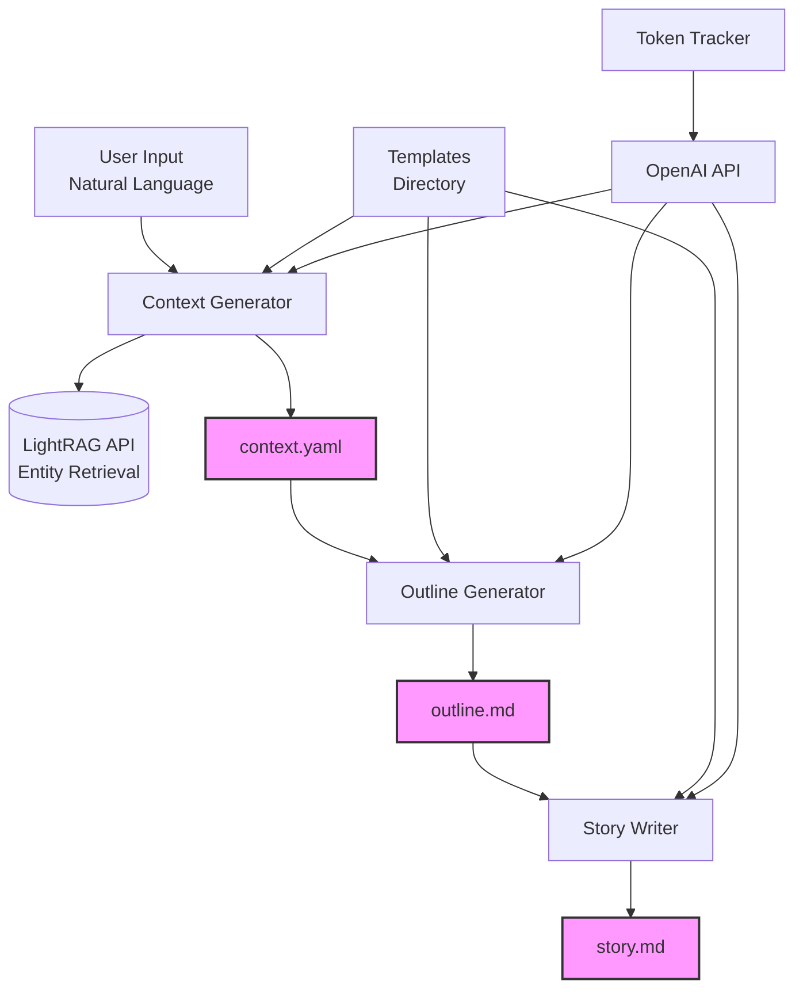

# High Level Architecture

## Technical Summary

The system employs a modular pipeline architecture with three distinct stages (context generation, outline creation, story writing) that process data sequentially through file-based intermediates. Built as a Python CLI application, it integrates with the LightRAG API for read-only entity retrieval and uses OpenAI's API for content generation. The architecture prioritizes human control through editable intermediate files, cost optimization through token tracking, and extensibility through external template files. This design directly supports the PRD goals of controlled story generation with consistent world-building.

## High Level Overview

The main architectural style is a **Pipeline Architecture** with file-based communication between stages. This aligns with the PRD's requirement for human intervention at each stage.

- **Repository Structure**: Monorepo containing CLI application, templates, and tests
- **Service Architecture**: Monolithic CLI with modular components
- **Data Flow**: Natural Language Input → Context (YAML) → Outline (Markdown) → Story (Markdown)
- **Key Decision Rationale**: File-based intermediates allow manual editing and parallel story development

## High Level Project Diagram

## Architectural and Design Patterns

- **Pipeline Pattern:** Three-stage sequential processing with file-based communication - *Rationale:* Enables human intervention and independent stage execution
- **Repository Pattern:** Abstract LightRAG API operations behind interface - *Rationale:* Enables testing with mocks and future retrieval system migration
- **Template Method Pattern:** External templates with variable substitution - *Rationale:* Allows prompt modification without code changes
- **Command Pattern:** CLI commands encapsulate operations - *Rationale:* Supports both high-level and granular operations
- **Factory Pattern:** Entity creation based on type (character/location/item) - *Rationale:* Standardizes entity creation with type-specific attributes
