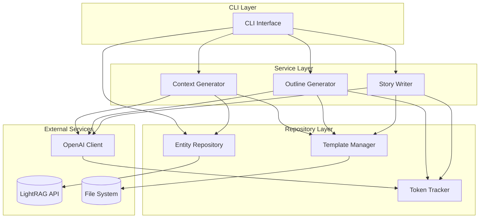

# Component Diagrams

```mermaid
graph TD
    subgraph "CLI Layer"
        CLI[CLI Interface]
    end

    subgraph "Service Layer"
        CG[Context Generator]
        OG[Outline Generator]
        SW[Story Writer]
    end

    subgraph "Repository Layer"
        ER[Entity Repository]
        TM[Template Manager]
        TT[Token Tracker]
    end

    subgraph "External Services"
        OAI[OpenAI Client]
        LR[(LightRAG API)]
        FS[(File System)]
    end

    CLI --> CG
    CLI --> OG
    CLI --> SW
    CLI --> ER

    CG --> ER
    CG --> TM
    CG --> OAI

    OG --> TM
    OG --> OAI
    OG --> TT

    SW --> TM
    SW --> OAI
    SW --> TT

    ER --> LR
    TM --> FS
    OAI --> TT
```
