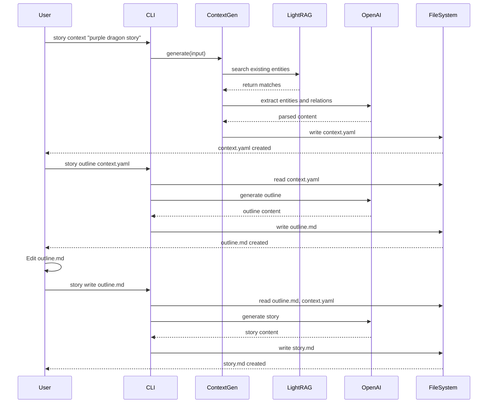

# Core Workflows

```mermaid
sequenceDiagram
    participant User
    participant CLI
    participant ContextGen
    participant LightRAG
    participant OpenAI
    participant FileSystem
    
    User->>CLI: story context "purple dragon story"
    CLI->>ContextGen: generate(input)
    ContextGen->>LightRAG: search existing entities
    LightRAG-->>ContextGen: return matches
    ContextGen->>OpenAI: extract entities and relations
    OpenAI-->>ContextGen: parsed content
    ContextGen->>FileSystem: write context.yaml
    FileSystem-->>User: context.yaml created
    
    User->>CLI: story outline context.yaml
    CLI->>FileSystem: read context.yaml
    CLI->>OpenAI: generate outline
    OpenAI-->>CLI: outline content
    CLI->>FileSystem: write outline.md
    FileSystem-->>User: outline.md created
    
    User->>User: Edit outline.md
    
    User->>CLI: story write outline.md
    CLI->>FileSystem: read outline.md, context.yaml
    CLI->>OpenAI: generate story
    OpenAI-->>CLI: story content
    CLI->>FileSystem: write story.md
    FileSystem-->>User: story.md created
```
