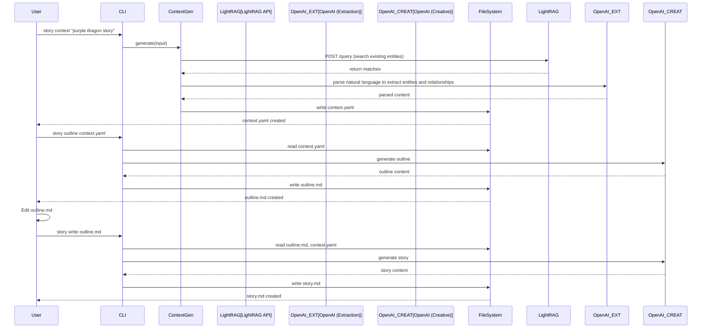

# Core Workflows

```mermaid
sequenceDiagram
    participant User
    participant CLI
    participant ContextGen
    participant LightRAG[LightRAG API]
    participant OpenAI_EXT[OpenAI (Extraction)]
    participant OpenAI_CREAT[OpenAI (Creative)]
    participant FileSystem

    User->>CLI: story context "purple dragon story"
    CLI->>ContextGen: generate(input)
    ContextGen->>LightRAG: POST /query (search existing entities)
    LightRAG-->>ContextGen: return matches
    ContextGen->>OpenAI_EXT: parse natural language to extract entities and relationships
    OpenAI_EXT-->>ContextGen: parsed content
    ContextGen->>FileSystem: write context.yaml
    FileSystem-->>User: context.yaml created

    User->>CLI: story outline context.yaml
    CLI->>FileSystem: read context.yaml
    CLI->>OpenAI_CREAT: generate outline
    OpenAI_CREAT-->>CLI: outline content
    CLI->>FileSystem: write outline.md
    FileSystem-->>User: outline.md created

    User->>User: Edit outline.md

    User->>CLI: story write outline.md
    CLI->>FileSystem: read outline.md, context.yaml
    CLI->>OpenAI_CREAT: generate story
    OpenAI_CREAT-->>CLI: story content
    CLI->>FileSystem: write story.md
    FileSystem-->>User: story.md created
```
